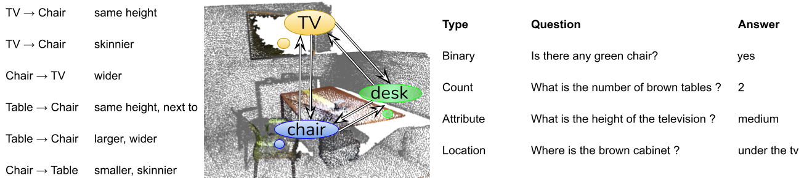

# 3DVQA

## Overview

This repository contains code for generating 3DVQA dataset and set of baseline models for the dataset. 

<p align="center"></p>

[Paper](https://ieeexplore.ieee.org/document/9866910) [Website](https://3dlg-hcvc.github.io/3DVQA/) [Data](#get-the-data)


## Setup
The implementation has been tested on Ubuntu 20.04, with PyTorch 1.6, CUDA 10

* Clone the repository and download GloVe vectors
```sh
git clone --recurse-submodules git@github.com:3dlg-hcvc/3DVQA.git
cd 3DVQA
git checkout CRV_3DVQA
wget https://nlp.stanford.edu/data/glove.6B.zip
unzip glove.6B.zip
```
* Setup python environment (it includes requirements for votenet)
```sh
conda create -n 3dvqa python=3.7 
conda activate 3dvqa  
pip install -r requirements.txt
```
Install pointnet2 submodule:
```
cd /path/to/votenet_with_colors/pointnet2/
python setup.py install
```
Add path to votenet with colors repo to your `PYTHONPATH`

```
export PYTHONPATH="${PYTHONPATH}:/path/to/3DVQA/3dvqa/votenet_with_colors/"
```

Also if you want to train the model you have to follow votenet's `GETTING_STARTED` (prepare scannet_train_detection_data)

## Known Issues

If pointnet2 compilation fails with error `/usr/include/c++/11/bits/std_function.h:435:145: error: parameter packs not expanded with ‘...’:` [this](https://github.com/NVlabs/instant-ngp/issues/119#issuecomment-1034701258) comment might help you.

If you have `ModuleNotFoundError: No module named 'votenet_with_color'` here is your solution:
`export PYTHONPATH="$PYTHONPATH:/PATH/TO/3DVQA/3dvqa/"`

## Get the Data

The 3DVQA dataset is generated from [ScanNet](https://github.com/ScanNet/ScanNet).  To download the ScanNet data visit their [repo](https://github.com/ScanNet/ScanNet). You can also get the train/val/test splits from [here](https://github.com/ScanNet/ScanNet/tree/master/Tasks/Benchmark). For our paper, we used the version 1 splits(scannetv1_(train/val/test).txt).

To train the model and replicate experiments in our paper, please download the following: 
  - [sampled dataset](https://aspis.cmpt.sfu.ca/projects/3dvqa/data/sampled.zip) of questions and answers.  Download this to train/evaluate models for the paper 
  - [votenet.hdf5](https://aspis.cmpt.sfu.ca/projects/3dvqa/data/votenet_hdf5.zip) - hdf5 file with extracted votenet features 

The point clouds can be downloaded by running `get_pointClouds.py`, or directly [here](https://aspis.cmpt.sfu.ca/projects/3dvqa/data/point_cloud.zip).
The votenet and pointnet hdf5 files are generated by running the vision_method.py.


For evaluation, we provide a [checkpoint](https://aspis.cmpt.sfu.ca/projects/3dvqa/data/checkpoint.tar) for the Votenet + LSTM model.

As part of our dataset, we also provide 
  - the [full 3DVQA dataset](https://aspis.cmpt.sfu.ca/projects/3dvqa/data/QA.zip)
  - [scene graphs](https://aspis.cmpt.sfu.ca/projects/3dvqa/data/scene-graph.zip)  

## Train and Evaluation

To run the code you need to change the config file in the model. You can also choose between different methods by specifying it in the config file. Run
``` python model.py ``` to start the training process. After training is done based on the validation acuracy and number of epochs the evaluation will start. 

For the evaluation, you can run the evaluation.py code in the model folder. For the votenet+lstm model download the checkpoint and the votenet.hdf5 file and edit the paths in config.py respectively. Also, remember that fused_attention should be False and method should be votenet.

Remember to change these options in config.py:

`glove`: Path to glove embeddings (glove.6B.300d.txt file)

`qa_path`: Path to the folder containg 3dvqa-scannet dataset(sampled version)

`splits`: Path to the folder containing txt files for val/train/test splits

`votenet_hdf5`: Path to the visual representation taken from votenet, you can download it from [here](https://aspis.cmpt.sfu.ca/projects/3dvqa/data/votenet_hdf5.zip)

`pointnet_hdf5`: path to the visual representation taken from pointnet++

`im_path`: Folder path of the top view image of scannet scenes 

`checkpoint_path`: Path to save the checkpoint during training and to load checkpoints during evaluation

`method`: Choose the method, it can be `votenet`, `pointnet`, `lstm`, `2dvqa`, `votenet_only`, `pointnet_only`, `2dvqa_only`

`fused_attention`: Use 3d fused attention if true

`do_val`: True if you want to evaluate on validation set

`do_test`: True if you want to evaluate on test set

`lr`: Learning rate

`step_size`: Step size for scheduler

`gamma`: Gamma for scheduler

`epochs`: Maximum number of epochs

`embedding_dim`: Embedding dimension of the lstm

`hidden_dim`: Hidden dimention of the lstm

## Acknowledgement

This repo uses [votenet](https://github.com/facebookresearch/votenet) and [pointnet++](https://github.com/erikwijmans/Pointnet2_PyTorch)(pytorch version )codes.

## Citation

```
@inproceedings{etesam20223dvqa,
            author = {Etesam, Yasaman and Kochiev, Leon and Chang, Angel X.},
            title = {3DVQA: Visual Question Answering for 3D Environments},
            booktitle = {Conference on Robots and Vision (CRV)},
            year = 2022
         } 
```
